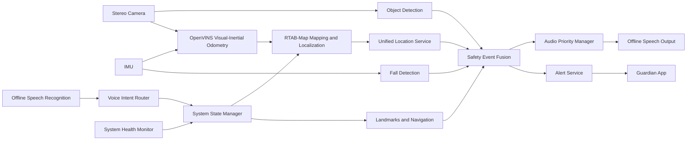

# RDK X5-Based Smart Cane for Visually Impaired Users

> An integrated smart cane system for environmental perception, indoor navigation, offline speech interaction, and emergency assistance.

[中文](README_cn.md) | English

## 1. Project Overview

This project implements a smart cane for visually impaired users with the **RDK X5** as the main computing platform. It integrates stereo vision, IMU sensing, object detection, offline speech interaction, OpenVINS, RTAB-Map indoor SLAM, path planning, fall detection, and remote emergency notification.

The system addresses environmental awareness, direction guidance, destination search, and emergency response through four core functions:

1. **Indoor mapping and navigation**: The system builds an indoor map from stereo images and IMU data, binds the current position to names such as entrance, elevator, and restroom, and generates navigation instructions after the user says a command such as “Take me to the elevator.”
2. **Object detection and safety alerts**: The system detects traffic lights, puddles, manhole covers, slippery areas, pedestrian prohibition signs, and crosswalks, and provides spoken warnings according to object type and distance.
3. **Fall detection and remote alerting**: IMU acceleration, angular velocity, and posture changes are used to detect possible falls. The event and latest position are sent to a guardian application with a map navigation entry.
4. **Offline speech interaction**: The system supports mapping commands, named landmark registration, destination navigation, navigation cancellation, date/time/weather queries, system status announcements, and low-battery alerts.

ROS 2/TROS topics connect the functional modules. A unified state manager, event router, audio priority manager, location cache, process supervisor, health monitor, and systemd service allow perception, navigation, fall detection, and speech interaction to operate as one coordinated system.

## 2. System Architecture



The system contains five layers:

- **Hardware and drivers**: RDK X5, stereo camera, IMU, microphone, speaker, battery monitor, and network interface.
- **Perception and localization**: object detection, stereo ranging, OpenVINS visual-inertial odometry, and RTAB-Map mapping/localization.
- **Interaction and applications**: offline ASR/TTS, named landmark management, path planning, real-time navigation, and the guardian application.
- **Coordination and safety**: state machine, command routing, safety event routing, audio preemption, location caching, and health monitoring.
- **Deployment and runtime**: unified startup, logging, process recovery, status inspection, and boot-time startup.

## 3. Core Functions

### 3.1 Object Detection and Safety Alerts

The detection model covers the following classes:

- traffic light;
- puddle;
- manhole cover;
- slippery area;
- pedestrian prohibition sign;
- crosswalk.

Training code is stored in `detection/kaggle_training/`. Model export, quantization, and RDK conversion code is stored in `detection/rdk_conversion/`. Board-side inference is stored in `detection/runtime/`.

The runtime node handles image acquisition, BPU inference, output decoding, confidence filtering, non-maximum suppression, and distance estimation. Valid detections are published to the safety event fusion layer.

### 3.2 Indoor Mapping and Navigation

The indoor navigation subsystem combines OpenVINS and RTAB-Map:

1. The stereo camera and IMU publish synchronized visual and inertial data.
2. OpenVINS provides continuous visual-inertial odometry.
3. RTAB-Map performs map construction, keyframe management, loop closure, and global pose correction.
4. The landmark manager binds the current pose to a spoken place name.
5. The path planner generates a route from the current position to the selected landmark.
6. The real-time navigator produces forward, left-turn, right-turn, heading-correction, and arrival instructions.

Mapping, landmark registration, map export, localization verification, route planning, and navigation code is stored in `slam_nav/`. OpenVINS configuration, startup, bridge, and health monitoring code is stored in `openvins/`.

### 3.3 Fall Detection and Remote Alerting

The fall detection program is stored in `fall/rdk_x5/`. It continuously analyzes acceleration peaks, angular velocity, posture changes, and the stationary period after an impact.

After a fall event is generated, the system:

1. enters the emergency state;
2. preempts ordinary navigation and perception prompts;
3. reads the unified location cache;
4. records the event time, detection result, and position;
5. sends an alert to the guardian application;
6. displays the alert details and map navigation entry in the app.

`fall_history.json` stores fall history, `last_position.json` stores the latest position, and `adapters/fall_file_adapter.py` connects file-based events to the unified ROS event channel.

### 3.4 Offline Speech Interaction

The speech subsystem is stored in `voice/` and includes offline speech recognition, intent parsing, and offline text-to-speech output.

Supported commands include:

- start and stop mapping;
- register the current position as a named landmark;
- navigate to a named destination;
- stop or cancel navigation;
- query the current time and date;
- query the weather;
- query the current system status.

Recognized speech is converted into a unified intent before the state manager executes an action. All spoken output passes through one audio queue so that different modules do not speak at the same time.

## 4. Multi-Module Integration

### 4.1 System State Management

The runtime state machine uses the following states:

| State | Description |
|---|---|
| `BOOTING` | Device, model, and ROS node initialization |
| `IDLE` | Waiting for commands |
| `MAPPING` | Indoor mapping and landmark registration |
| `LOCALIZING` | Localization on an existing map |
| `NAVIGATING` | Navigation to a named destination |
| `EMERGENCY` | Fall alert and emergency speech output |
| `DEGRADED` | Core functions continue while one or more modules are unavailable |

`bringup/system_state_manager.py` controls state transitions and mutually exclusive operations. Mapping and localization do not access the same map database at the same time. A fall event immediately moves the system into the emergency state and keeps the alert path active.

### 4.2 Audio Priority

Speech output follows the safety priority of each event:

| Event | Priority |
|---|---:|
| Fall and emergency alert | 100 |
| Imminent collision | 90 |
| Puddle, slippery area, or prohibited passage | 80 |
| System fault and low battery | 70-75 |
| Navigation turn and arrival instruction | 60 |
| General perception notice | 40 |
| Date, time, and weather response | 20 |

`bringup/audio_priority_manager.py` provides queueing, emergency preemption, duplicate suppression, and cooldown control.

### 4.3 Unified Location Service

`bringup/location_cache_node.py` subscribes to RTAB-Map or fused odometry, publishes the latest pose on `/smart_cane/location/current`, and atomically updates `fall/rdk_x5/last_position.json`. Navigation, landmark registration, and fall reporting therefore use the same location source.

### 4.4 Process Supervision and Recovery

`bringup/smart_cane_supervisor.py` starts modules according to `config/modules.yaml`, stores separate logs, and restarts processes according to their restart policies. `bringup/health_monitor.py` publishes CPU, memory, disk, and system load information for runtime monitoring and degraded-mode handling.

## 5. Repository Structure

```text
smart_cane_ros/
├── README.md                      # English documentation
├── README_cn.md                   # Chinese documentation
├── LICENSE                        # Open-source license
├── THIRD_PARTY_NOTICES.md         # Third-party notices
├── CHANGELOG.md                   # Version history
├── requirements-runtime.txt       # Python runtime dependencies
├── adapters/                      # Adapters for existing scripts
│   └── fall_file_adapter.py
├── bringup/                       # Integration, state control, and supervision
│   ├── smart_cane_supervisor.py
│   ├── system_state_manager.py
│   ├── voice_command_router.py
│   ├── safety_event_router.py
│   ├── audio_priority_manager.py
│   ├── location_cache_node.py
│   └── health_monitor.py
├── config/                        # Runtime and module configuration
│   ├── modules.yaml
│   ├── system.yaml
│   ├── voice_commands.yaml
│   └── alert_priority.yaml
├── deploy/                        # RDK X5 deployment and systemd service
├── detection/                     # Training, conversion, and board inference
│   ├── kaggle_training/
│   ├── rdk_conversion/
│   └── runtime/
├── fall/                          # Fall detection and guardian application
│   ├── app/
│   └── rdk_x5/
├── interfaces/msg/                # ROS message definitions
├── launch/                        # Unified ROS 2 launch entry
├── openvins/                      # OpenVINS configuration and bridge
├── scripts/                       # Start, stop, status, and preflight tools
├── slam_nav/                      # Mapping, landmarks, planning, and navigation
├── tests/                         # Basic tests
├── viz/                           # Visualization bridge
└── voice/                         # Offline speech recognition and output
```


## 6. Runtime Environment

### 6.1 Hardware

- RDK X5;
- RDK GS130WI stereo camera and its IMU;
- microphone and speaker;
- battery and battery-level monitor;
- wireless network connection for weather queries and remote alerts.

### 6.2 Software

- Ubuntu / official RDK X5 system environment;
- TROS or a ROS 2 Humble-compatible environment;
- Python 3;
- OpenVINS;
- RTAB-Map;
- OpenCV;
- RDK BPU runtime.

## 7. Quick Start

### 7.1 Install Python Dependencies

```bash
python3 -m pip install -r requirements-runtime.txt
```

### 7.2 Create the Local Environment File

```bash
cp deploy/env.example deploy/env.local
```

`deploy/env.local` stores the project path, ROS/TROS setup script, and device runtime values. `config/modules.yaml` stores module startup commands. `config/system.yaml` stores map paths, database paths, odometry topics, and location file paths.

### 7.3 Run the Preflight Check

```bash
python3 scripts/preflight_check.py
```

### 7.4 Start Navigation Mode

```bash
bash scripts/start_all.sh navigation
```

### 7.5 Start Mapping Mode

```bash
bash scripts/start_all.sh mapping
```

### 7.6 Show Status and Stop

```bash
bash scripts/status.sh
bash scripts/stop_all.sh
```

## 8. Boot-Time Startup

Install and enable the systemd service:

```bash
sudo bash deploy/install_autostart.sh
sudo systemctl enable --now smart-cane.service
```

Show service status:

```bash
sudo systemctl status smart-cane.service
```

Follow runtime logs:

```bash
journalctl -u smart-cane.service -f
```

Stop the service:

```bash
sudo systemctl stop smart-cane.service
```

Remove the boot-time service:

```bash
sudo bash deploy/uninstall_autostart.sh
```

## 9. Main ROS Interfaces

| Topic | Data |
|---|---|
| `/smart_cane/voice/intent` | Offline speech intent and named-place slots |
| `/smart_cane/system/request` | Mapping, landmark, navigation, and query requests |
| `/smart_cane/perception/event` | Object class, confidence, bounding box, and distance |
| `/smart_cane/fall/event` | Fall detection result and IMU features |
| `/smart_cane/location/current` | Current map pose, heading, and timestamp |
| `/smart_cane/navigation/instruction` | Forward, turn, correction, and arrival instructions |
| `/smart_cane/audio/request` | Speech text, priority, and cooldown |
| `/smart_cane/voice/speak` | Final output sent to offline TTS |
| `/smart_cane/system/health` | CPU, memory, disk, and module health information |

Message payload examples are documented in `docs/ROS_INTERFACES_CN.md`.

## 10. Typical Workflows

### 10.1 Landmark Registration

```text
The user says “This is the elevator.”
        ↓
Offline speech recognition and intent parsing
        ↓
Read the current map pose and heading
        ↓
Store the elevator name, pose, and map association
        ↓
Speak “The current position has been saved as elevator.”
```

### 10.2 Destination Navigation

```text
The user says “Take me to the elevator.”
        ↓
Load the elevator position
        ↓
Generate a path from the current pose
        ↓
Track the route and heading error in real time
        ↓
Speak forward, turn, correction, and arrival instructions
```

### 10.3 Hazard Alert During Navigation

```text
Navigation requests “Turn left in two meters.”
        +
Object detection finds a puddle ahead
        ↓
The safety router compares event priorities
        ↓
The system first speaks “Possible puddle ahead. Please detour.”
        ↓
Navigation continues
```

### 10.4 Fall Alert

```text
The IMU detects a possible fall
        ↓
The state machine enters EMERGENCY
        ↓
Emergency speech preempts ordinary prompts
        ↓
The latest position is read and the event is recorded
        ↓
An alert is sent to the guardian app
        ↓
The app displays the position and map navigation entry
```

## 11. Testing

Repository and syntax tests:

```bash
python3 -m compileall bringup adapters detection/runtime scripts
python3 tests/smoke_test.py
```

System tests cover:

- independent startup of each functional module;
- switching between mapping and localization;
- landmark registration and destination navigation;
- perception alerts during navigation;
- fall alerts during navigation;
- local operation during a network outage;
- automatic recovery after a module exits;
- boot-time startup after an RDK X5 restart.

## 12. Safety Notice

This project is an entry for the Embedded Chip and System Design Competition and is intended as a research and engineering aid for visually impaired users. It is not a certified medical or mobility device. Object detection, localization, path planning, and fall classification may be affected by lighting, occlusion, texture, sensor error, network availability, and the operating environment.

Human assistance, accessibility infrastructure, and additional safety measures remain necessary in high-risk environments such as stairs, railway platforms, and roads with motor vehicles.

## 13. License

Original project code is released under the Apache License 2.0. OpenVINS, RTAB-Map, ROS 2/TROS, OpenCV, the RDK toolchain, speech models, push notification SDKs, datasets, and model weights remain subject to their respective licenses. Third-party information is recorded in `THIRD_PARTY_NOTICES.md`.
