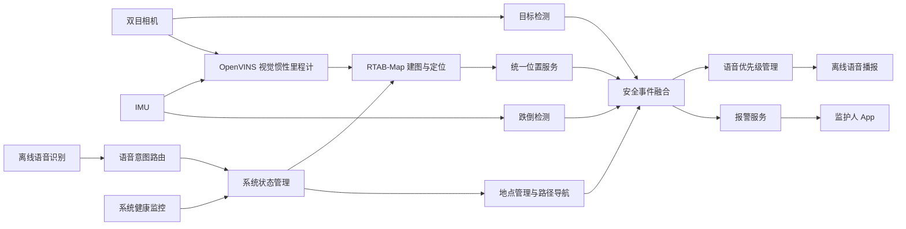

# 基于 RDK X5 的智能导盲杖系统

> ——面向视障人群的环境感知、室内导航、离线语音交互与紧急救助一体化系统。

[English](README.md) | 中文

## 1. 项目简介

本项目以 **RDK X5** 为核心计算平台，融合双目视觉、IMU、目标检测、离线语音交互、OpenVINS、RTAB-Map 室内 SLAM、路径规划和远程报警等技术，设计并实现了一款面向视障人群的智能导盲杖。

系统围绕视障用户在室内外通行过程中面临的环境识别、方向判断、地点查找和突发跌倒等问题，形成了四项核心功能：

1. **室内建图与导航**：利用双目相机和 IMU 完成室内定位建图，将当前位置与“门口、电梯、洗手间”等地点名称绑定；用户说出“我要去电梯”等指令后，系统读取目标地点坐标，完成路径规划并播报直行、转向和到达提示。
2. **目标识别与安全提示**：实时识别交通信号灯、水洼、井盖、地滑区域、禁止行人通行标志和人行横道等目标，根据识别结果和目标距离进行语音提醒。
3. **跌倒检测与远程报警**：根据 IMU 加速度、角速度和姿态变化判断跌倒事件，发生异常时记录事件信息，并向监护人 App 发送报警和最近位置，支持地图跳转导航。
4. **离线语音交互**：支持地点标记、目标导航、导航取消、系统状态查询、日期时间查询、天气查询和低电量提醒等语音功能。

项目采用 ROS 2/TROS 消息机制连接各功能模块，通过统一状态管理、事件路由、语音优先级、位置缓存、进程守护和 systemd 开机自启，实现目标识别、室内导航、跌倒检测和语音交互的协同运行。

## 2. 系统总体架构



系统由五个层次组成：

- **硬件与驱动层**：RDK X5、双目相机、IMU、麦克风、扬声器、电池检测和网络通信模块。
- **感知与定位层**：目标检测、双目测距、OpenVINS 视觉惯性里程计和 RTAB-Map 建图定位。
- **交互与应用层**：离线语音识别、离线语音合成、地点管理、路径规划、实时导航和监护人 App。
- **融合协调层**：系统状态机、语音命令路由、安全事件路由、语音抢占、位置缓存和健康监控。
- **部署运行层**：统一启动、日志记录、异常恢复、运行状态检查和开机自启。

## 3. 核心功能

### 3.1 目标识别与安全提示

目标检测模型包含以下类别：

- 交通信号灯；
- 水洼；
- 井盖；
- 地滑区域；
- 禁止行人通行标志；
- 人行横道。

训练代码位于 `detection/kaggle_training/`，模型导出、量化和 RDK 转换代码位于 `detection/rdk_conversion/`，板端推理程序位于 `detection/runtime/`。运行时节点完成图像采集、BPU 推理、结果解码、置信度筛选、非极大值抑制和距离估计，并将结果发布到安全事件融合模块。

### 3.2 室内建图与导航

室内建图导航模块采用 OpenVINS 与 RTAB-Map 组合架构：

1. 双目相机和 IMU 提供带时间戳的视觉与惯性数据；
2. OpenVINS 输出连续、平滑的视觉惯性里程计；
3. RTAB-Map 完成地图构建、关键帧管理、回环检测和全局位姿修正；
4. 地点管理程序将当前位置与地点名称绑定；
5. 路径规划程序依据当前位置、目标地点和可通行地图生成路径；
6. 实时导航程序持续计算用户相对路径的位置，并输出直行、左转、右转、偏航纠正和到达提示。

建图、地点记录、地图保存、定位验证、路径规划和实时导航代码位于 `slam_nav/`，OpenVINS 的配置、桥接、启动和健康监控代码位于 `openvins/`。

### 3.3 跌倒检测与远程报警

跌倒检测程序位于 `fall/rdk_x5/`。系统持续读取 IMU 数据，根据加速度峰值、角速度、姿态变化和落地后静止状态进行综合判断。跌倒事件生成后，系统执行以下流程：

1. 进入紧急状态；
2. 抢占普通导航和目标识别播报；
3. 读取统一位置缓存；
4. 记录跌倒时间、检测结果和位置；
5. 通过报警服务向监护人 App 推送消息；
6. 在 App 中展示报警详情和地图导航入口。

`fall_history.json` 用于保存跌倒历史，`last_position.json` 用于保存最近位置，`adapters/fall_file_adapter.py` 用于将文件事件接入统一 ROS 事件通道。

### 3.4 离线语音交互

语音模块位于 `voice/`，包含离线语音识别、意图解析和离线语音播报。系统支持以下类型的指令：

- “开始建图”“结束建图”；
- “这里是电梯”“标记这里为洗手间”；
- “我要去门口”“导航到电梯”；
- “停止导航”“取消导航”；
- “现在几点”“今天几号”；
- “今天天气怎么样”；
- “系统状态”“设备正常吗”。

语音识别结果首先转换为统一意图，再由系统状态管理器执行对应操作。所有语音输出均进入统一音频队列，避免多个功能同时播报。

## 4. 多功能融合机制

### 4.1 系统状态管理

系统运行状态包括：

| 状态 | 说明 |
|---|---|
| `BOOTING` | 设备、模型和 ROS 节点初始化 |
| `IDLE` | 系统待机并接收语音指令 |
| `MAPPING` | 室内建图与地点记录 |
| `LOCALIZING` | 基于已有地图进行定位 |
| `NAVIGATING` | 执行目标地点导航 |
| `EMERGENCY` | 跌倒报警和紧急语音提示 |
| `DEGRADED` | 部分模块异常时保留可用功能 |

`bringup/system_state_manager.py` 负责状态切换和功能互斥。建图与定位不会同时占用地图数据库；跌倒事件发生后，系统立即进入紧急状态并保持报警链路。

### 4.2 语音优先级

系统按照事件安全等级安排播报顺序：

| 事件类型 | 优先级 |
|---|---:|
| 跌倒和紧急报警 | 100 |
| 近距离碰撞风险 | 90 |
| 水洼、地滑、禁止通行等危险信息 | 80 |
| 系统故障和低电量 | 70～75 |
| 导航转向和到达提示 | 60 |
| 普通目标识别提示 | 40 |
| 日期、时间、天气等查询结果 | 20 |

`bringup/audio_priority_manager.py` 负责播报排队、紧急抢占、重复信息抑制和提示冷却。

### 4.3 统一位置服务

`bringup/location_cache_node.py` 订阅 RTAB-Map 或融合里程计，将最新位姿发布到 `/smart_cane/location/current`，同时以原子写入方式更新 `fall/rdk_x5/last_position.json`。导航、地点标记和跌倒报警使用同一位置来源。

### 4.4 进程守护与故障恢复

`bringup/smart_cane_supervisor.py` 根据 `config/modules.yaml` 启动各模块，记录独立日志，并根据模块属性执行异常重启。`bringup/health_monitor.py` 周期发布 CPU、内存、磁盘和系统负载信息，用于运行状态监控和降级处理。

## 5. 仓库结构

```text
smart_cane_ros/
├── README.md                      # English documentation
├── README_cn.md                   # 中文说明
├── LICENSE                        # 开源许可证
├── THIRD_PARTY_NOTICES.md         # 第三方组件说明
├── CHANGELOG.md                   # 版本记录
├── requirements-runtime.txt       # Python 运行依赖
├── adapters/                      # 现有脚本与 ROS 接口适配
│   └── fall_file_adapter.py
├── bringup/                       # 系统融合、状态管理和进程守护
│   ├── smart_cane_supervisor.py
│   ├── system_state_manager.py
│   ├── voice_command_router.py
│   ├── safety_event_router.py
│   ├── audio_priority_manager.py
│   ├── location_cache_node.py
│   └── health_monitor.py
├── config/                        # 系统、模块、语音和优先级配置
│   ├── modules.yaml
│   ├── system.yaml
│   ├── voice_commands.yaml
│   └── alert_priority.yaml
├── deploy/                        # RDK X5 部署与 systemd 服务
├── detection/                     # 模型训练、转换和板端推理
│   ├── kaggle_training/
│   ├── rdk_conversion/
│   └── runtime/
├── fall/                          # 跌倒检测与监护人端
│   ├── app/
│   └── rdk_x5/
├── interfaces/msg/                # ROS 自定义消息定义
├── launch/                        # ROS 2 统一启动入口
├── openvins/                      # OpenVINS 配置与融合桥接
├── scripts/                       # 启动、停止、状态和环境检查脚本
├── slam_nav/                      # 建图、地点管理、规划和实时导航
├── tests/                         # 基础测试
├── viz/                           # 可视化桥接
└── voice/                         # 离线语音识别与播报
```


## 6. 运行环境

### 6.1 硬件

- RDK X5；
- RDK GS130WI 双目摄像头及其 IMU；
- 麦克风与扬声器；
- 电池及电量检测模块；
- 无线网络连接，用于天气查询和远程报警。

### 6.2 软件

- Ubuntu / RDK X5 官方系统环境；
- TROS 或 ROS 2 Humble 兼容环境；
- Python 3；
- OpenVINS；
- RTAB-Map；
- OpenCV；
- RDK BPU 推理运行时。

## 7. 快速运行

### 7.1 安装 Python 依赖

```bash
python3 -m pip install -r requirements-runtime.txt
```

### 7.2 生成本机环境文件

```bash
cp deploy/env.example deploy/env.local
```

`deploy/env.local` 统一保存工程目录、ROS/TROS 环境脚本和设备运行参数；`config/modules.yaml` 保存各功能模块的启动命令；`config/system.yaml` 保存地图、数据库、里程计话题和位置文件路径。

### 7.3 启动前检查

```bash
python3 scripts/preflight_check.py
```

### 7.4 启动导航模式

```bash
bash scripts/start_all.sh navigation
```

### 7.5 启动建图模式

```bash
bash scripts/start_all.sh mapping
```

### 7.6 查看与停止

```bash
bash scripts/status.sh
bash scripts/stop_all.sh
```

## 8. 开机自启

安装 systemd 服务：

```bash
sudo bash deploy/install_autostart.sh
sudo systemctl enable --now smart-cane.service
```

查看服务状态：

```bash
sudo systemctl status smart-cane.service
```

查看运行日志：

```bash
journalctl -u smart-cane.service -f
```

停止服务：

```bash
sudo systemctl stop smart-cane.service
```

移除开机自启服务：

```bash
sudo bash deploy/uninstall_autostart.sh
```

## 9. ROS 主要接口

| 话题 | 数据内容 |
|---|---|
| `/smart_cane/voice/intent` | 离线语音识别意图及地点参数 |
| `/smart_cane/system/request` | 建图、地点标记、导航和查询请求 |
| `/smart_cane/perception/event` | 目标类别、置信度、检测框和距离 |
| `/smart_cane/fall/event` | 跌倒检测结果及 IMU 特征 |
| `/smart_cane/location/current` | 当前地图坐标、方向和时间戳 |
| `/smart_cane/navigation/instruction` | 直行、转向、纠偏和到达提示 |
| `/smart_cane/audio/request` | 待播报文本、优先级和冷却时间 |
| `/smart_cane/voice/speak` | 发送给离线 TTS 的最终播报内容 |
| `/smart_cane/system/health` | CPU、内存、磁盘和模块健康状态 |

详细消息格式见 `docs/ROS_INTERFACES_CN.md`。

## 10. 典型运行流程

### 10.1 地点记录

```text
用户说“这里是电梯”
        ↓
离线语音识别与意图解析
        ↓
读取当前地图坐标和方向
        ↓
保存“电梯—坐标—地图”关联信息
        ↓
播报“已记录当前位置为电梯”
```

### 10.2 目标地点导航

```text
用户说“我要去电梯”
        ↓
读取电梯地点坐标
        ↓
根据当前位置与地图生成路径
        ↓
持续更新用户位姿和路径偏差
        ↓
播报直行、转向、纠偏和到达提示
```

### 10.3 导航中的危险提醒

```text
导航提示“前方两米左转”
        +
目标检测发现前方水洼
        ↓
安全事件融合模块比较优先级
        ↓
优先播报“前方可能有水洼，请绕行”
        ↓
继续执行导航
```

### 10.4 跌倒报警

```text
IMU 检测到疑似跌倒
        ↓
状态机进入 EMERGENCY
        ↓
紧急语音抢占普通播报
        ↓
读取最近位置并记录事件
        ↓
向监护人 App 推送报警
        ↓
App 展示位置和地图导航入口
```

## 11. 测试

基础语法和仓库结构测试：

```bash
python3 -m compileall bringup adapters detection/runtime scripts
python3 tests/smoke_test.py
```

系统测试覆盖以下场景：

- 各功能模块独立启动；
- 建图与定位模式切换；
- 地点记录与目标导航；
- 导航过程中触发目标识别提醒；
- 导航过程中触发跌倒报警；
- 网络中断后的本地功能运行；
- 单个模块异常退出后的自动恢复；
- 设备重启后的开机自启。

## 12. 安全说明

本项目为嵌入式芯片与系统设计竞赛参赛作品，定位为辅助视障人群出行的研究与工程实践系统，不属于经过医疗或无障碍辅助认证的商用设备。目标识别、定位、路径规划和跌倒检测可能受到光照、遮挡、纹理、传感器误差、网络状态和使用环境影响。

在楼梯、站台、机动车道路等高风险场景中，应结合人工陪同、无障碍设施和其他安全措施使用。

## 13. 开源许可证

本项目原创代码采用 Apache License 2.0。OpenVINS、RTAB-Map、ROS 2/TROS、OpenCV、RDK 工具链、语音模型、推送服务 SDK、训练数据和模型权重分别遵循其原始许可证，相关信息记录在 `THIRD_PARTY_NOTICES.md`。
